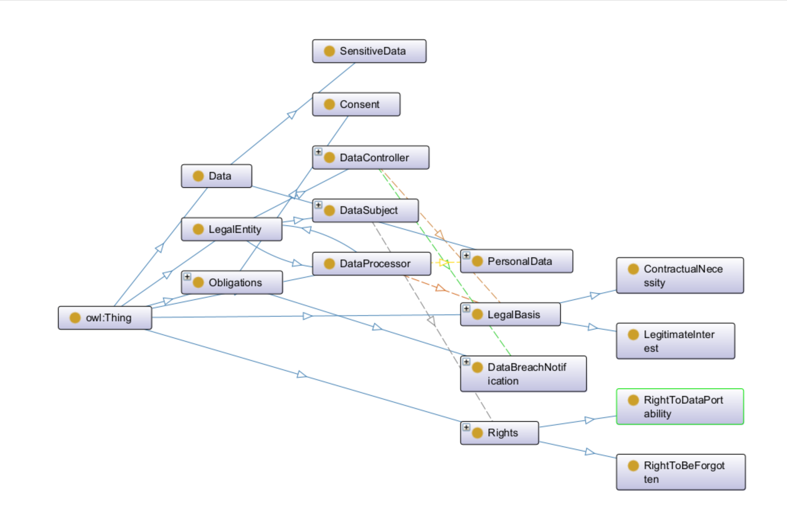

# GDPR Ontology

## Overview
This ontology represents **Basic Legal Concepts in GDPR (General Data Protection Regulation)**. It models key concepts such as **Data Subjects, Data Controllers, Personal Data, Rights, and Obligations**. The ontology follows OWL 2.0 standards and was developed using **Protégé**.

## Ontology Structure
The ontology consists of:

### **1. Classes** (Concepts)
- **LegalEntity**
  - `DataSubject`
  - `DataController`
  - `DataProcessor`
- **Data**
  - `PersonalData`
  - `SensitiveData`
- **Rights**
  - `RightToBeForgotten`
  - `RightToDataPortability`
- **Obligations**
  - `Consent`
  - `DataBreachNotification`
- **LegalBasis**
  - `LegitimateInterest`
  - `ContractualNecessity`

### **2. Object Properties (Relationships)**
- `hasLegalBasis` → (Domain: `DataProcessing`, Range: `LegalBasis`)
- `controlsData` → (Domain: `DataController`, Range: `PersonalData`)
- `processesData` → (Domain: `DataProcessor`, Range: `PersonalData`)
- `hasRight` → (Domain: `DataSubject`, Range: `Rights`)
- `notifiesBreach` → (Domain: `DataController`, Range: `DataBreachNotification`)

### **3. Data Properties (Attributes)**
- `hasName` → (Domain: `LegalEntity`, Range: `xsd:string`)
- `hasEmail` → (Domain: `DataSubject`, Range: `xsd:string`)
- `hasProcessingDate` → (Domain: `DataProcessing`, Range: `xsd:dateTime`)
- `hasBreachDate` → (Domain: `DataBreachNotification`, Range: `xsd:dateTime`)

## Ontology Graph Visualization
Below is the OntoGraf representation of the GDPR Ontology:

## Example Instances (Individuals)
| **Individual** | **Class** | **Relationships / Attributes** |
|--------------|-----------|-----------------------------|
| `Shah` | `DataSubject` | `hasRight → RightToBeForgotten` , `hasEmail → shahrukh.aleem@studenti.univr.it` |
| `Google` | `DataController` | `controlsData → User_Email` , `hasName → "Google"` |
| `CloudServiceProvider` | `DataProcessor` | `processesData → User_Email` |
| `User_Email` | `PersonalData` | `hasProcessingDate → "2024-01-31T10:00:00"` |
| `Breach_2025` | `DataBreachNotification` | `hasBreachDate → "2024-01-31T10:00:00"` |

## How to Use the Ontology
### **Opening the OWL File in Protégé**
1. **Open Protégé**.
2. **Load the OWL file** (`GDPR_Ontology.owx`).
3. **Explore classes, properties, and individuals** in the Protégé interface.
4. Use **OntoGraf** (`Window → Views → Ontology Views → OntoGraf`) to visualize relationships.

### **Running the Reasoner to Validate the Ontology**
1. Go to **Reasoner → Select HermiT Reasoner**.
2. Click **Start Reasoner**.
3. Ensure there are **no inconsistencies**.

### **Exporting or Querying the Ontology**
- The ontology can be **exported as RDF/XML, Turtle, or JSON-LD**.
- Use **SPARQL queries** within Protégé or external tools like **Apache Jena**.

## Future Improvements
- Extend the ontology to include **GDPR penalties and legal consequences**.
- Add **more obligations** such as `Data Impact Assessment` and `Privacy by Design`.
- Integrate with **external regulatory ontologies** for broader legal context.

---
### **Project Contributors**
**Shah Rukh Aleem** - Master's in Artificial Intelligence, University of Verona 
**Matricula Number:** VR528190

---
**License:** MIT License (or any applicable license for submission)

🚀 **Ontology successfully developed and ready for submission!**

